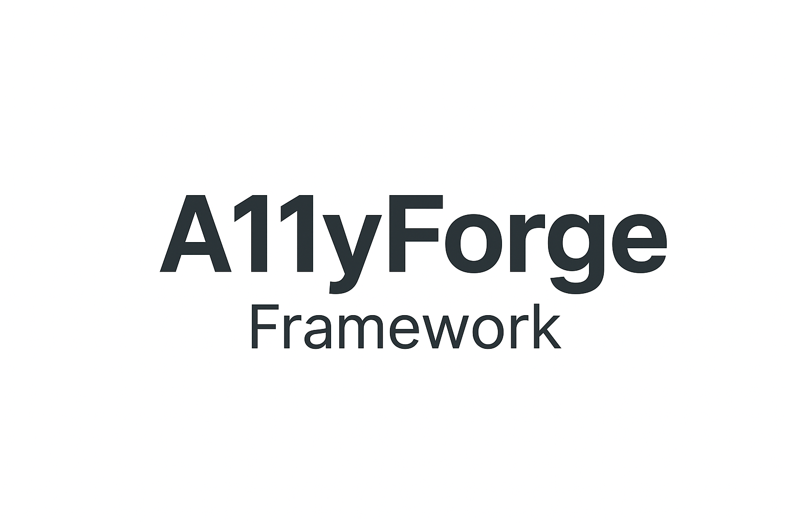

# A11yForge Framework

**A11yForge Framework** is a lightweight, accessibility-first web framework designed to help developers build inclusive and user-friendly websites with ease.  

---

## ✨ Features

- ♿ **Accessibility-first** — built with web accessibility (a11y) standards in mind  
- ⚡ **Lightweight & fast** — minimal setup, quick to start  
- 🎨 **Customizable** — easy to adapt styling and components  
- 🌐 **Cross-browser support** — works seamlessly across modern browsers  
- 📦 **Modular** — flexible structure for adding features as needed  

---

## 🚀 Getting Started

Clone the repository:

```bash
git clone https://github.com/your-username/a11yforge-framework.git
cd a11yforge-framework
```

Open `index.html` in your browser to view the demo.  

---

## 📚 Usage

- Use the included HTML/CSS as a base for your accessible web project  
- Customize styles in `styles.css`  
- Extend functionality with your own JavaScript  

---

## 🤝 Contributing

Contributions are welcome!  
If you’d like to improve A11yForge Framework, please fork the repo and open a pull request.  

---

## 📜 License

This project is licensed under the MIT License.  
See the [LICENSE](LICENSE) file for details.  

---

> Built with ❤️ to make the web accessible for everyone.  
